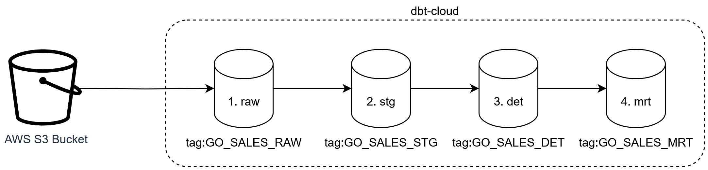

# Go Sales Snowflake dbt Sample Project 
This repository contains a sample dbt project that demonstrates how to model and transform the GO Sales IBM sample data using dbt (data build tool) with ❄️ Snowflake as the database engine. 


### Document Control
|Version|Date|Author|Description of Change|
|-|-|-|-|
|1.0|2025-07-18|Manzar Ahmed|Initial Version|

>NOTE: This sample project utlises the [GO Sales IBM sample data](https://dataplatform.cloud.ibm.com/exchange/public/entry/view/dcf7b09bd340e6ff9a2d1869631f3753) to demonstrate dbt modeling techniques. It is designed to be run with DuckDB as the database engine, but can be adapted for other engines like Snowflake, BigQuery, or Redshift with minor modifications to the dbt profiles and SQL syntax. The GO Sales dataset is a fictional retail dataset that simulates sales operations for a global retailer, and available under the MIT License. 

## Table of Content
<div class="alert alert-block alert-info" style="margin-top: 20px">

1. [Background](#1)<br>
2. [High Level Design](#2)<br>
3. [Run dbt Models](#3)<br>
3.1. [Raw Models (RAW)](#31)<br>
3.2. [Staging Models (STG)](#32)<br>
3.3. [Detailed Models (DET)](#33)<br>
3.4. [Mart Models (MRT)](#34)<br>
4. [Visualise Lineage with dbt Docs](#4)<br>
5. [Low-Level Design (LLD)](#5)<br>
5.1.1. [Models - raw layer](#511)<br>
5.1.2. [Models - stg layer](#512)<br>
5.1.3. [Models - det layer](#513)<br>
5.1.4. [Models - mrt layer](#514)<br>
5.1.5.  [Macros](#515)<br>
5.1.6. [Python Utils](#516)<br>
</div>
<hr>

## 1. Background <a id="1"></a>

The GO Sales IBM sample data is a fictional retail dataset designed to demonstrate business analytics, reporting, and data warehousing techniques. It simulates sales operations for a global retailer and contains various interconnected tables that model business domains. This project leverages dbt to transform the data and uses ❄️ Snowflake as the target data warehouse to house the final data solution. 

A copy of the GO Sales entity relationship diagram is provided below for reference.


This dbt_sample_snowflake project leverages dbt (data build tool) to transform the data and uses ❄️ Snowflake as the target cloud data warehouse for the final data solution. It re-uses the dbt models originally developed for DuckDB, adapting them through environment-specific configuration to point to a Snowflake endpoint. The original DuckDB-based project can be found here: https://github.com/manz01/dbt-core-sample-duckdb.

Rather than accessing the original MySQL database, this implementation sources raw CSV files from an S3 bucket, aligning with cloud-native, serverless architecture best practices and adopts the integration with Snowflake’s external stage capabilities.

**Case Sensitivity Note**

Snowflake is case-sensitive for unquoted identifiers, and by default, it stores unquoted column and table names in uppercase. To ensure cross-platform compatibility and avoid quoting issues, all column names and table identifiers in this project are standardised to uppercase.

## 2. High Level Design <a id="2"></a>

The dbt-core project follows a **layered design architecture** that structures data transformations through a series of refined stages. This layered approach promotes modularity, reusability, and is common best practice approach for building scalable data pipelines.



### Layer Breakdown:

1. **Raw Layer (`RAW`)**  
   - This layer ingests raw data directly from a AWS S3 Bucket.
   - It performs minimal transformation (if any), mainly focused on standardizing data types and storing source extracts as-is.

2. **Staging Layer (`STG`)**  
   - This layer acts as a clean-up zone where raw data is normalized, renamed, and prepared for further transformation.
   - Typical operations include renaming columns to snake_case, handling nulls, and deduplicating rows.

3. **Detailed Layer (`DET`)**  
   - This is the business logic layer, where transformations are applied to derive meaningful metrics and dimensions.
   - It includes joins, surrogate key generation, Slowly Changing Dimensions (SCD), and other enrichment logic.
   - The detailed layer will build a star schema for the go sales data

```text
 +------------------+  +--------------+
 |T_DIM_ORDER_METHOD|  |T_DIM_PRODUCTS|
 +------------------+  +--------------+
         \              /
          \            /
           +-----------+
           |T_FCT_SALES|
           +-----------+
           /          \
          /            \
   +-----------+    +---------------+
   |T_DIM_DATES|    |T_DIM_RETAILERS|
   +-----------+    +---------------+
```
4. **Mart Layer (`MRT`)**  
   - This final layer presents the data in a business-consumable format.
   - It aggregates and filters data for reporting, dashboards, and analytics use cases.

Each layer feeds into the next, ensuring that transformations are traceable and logically separated. 

## 3. Load from S3 to Snowflake


```sh
dbt run-operation load_raw_go_1k
dbt run-operation load_raw_go_methods
dbt run-operation load_raw_go_products
dbt run-operation load_raw_go_retailers
dbt run-operation load_raw_go_daily_sales

```