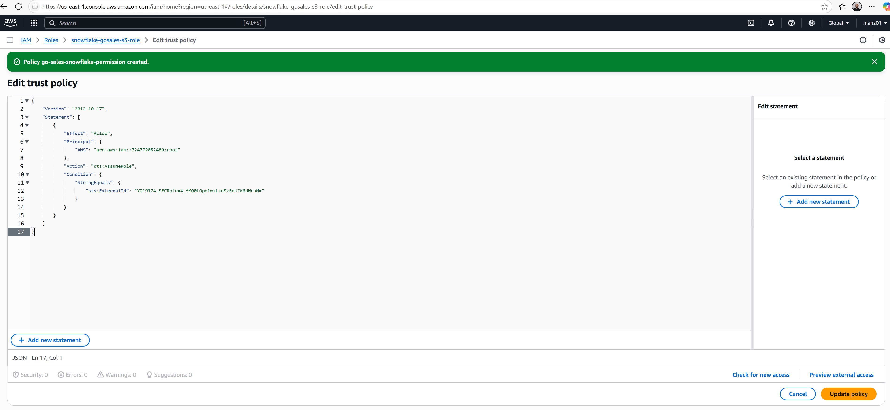
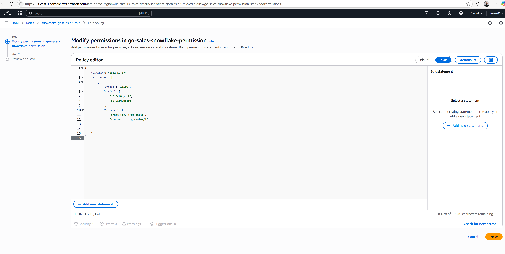
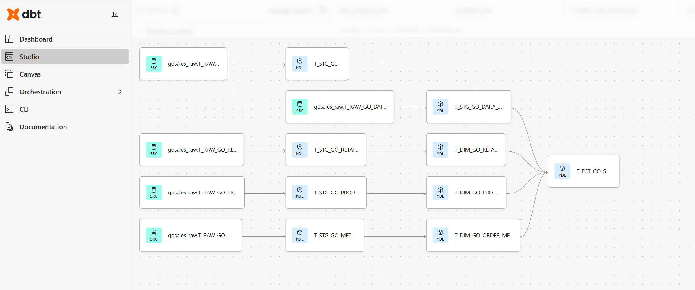
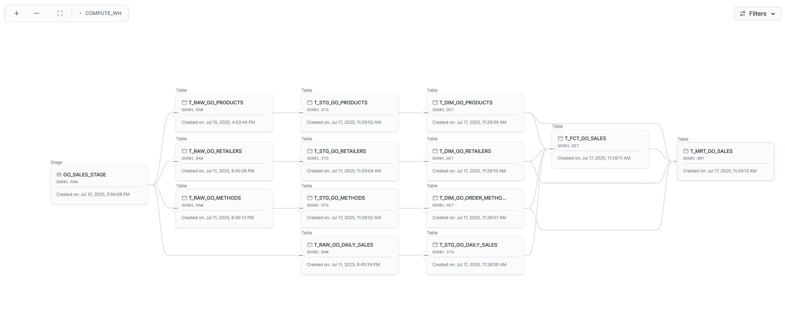
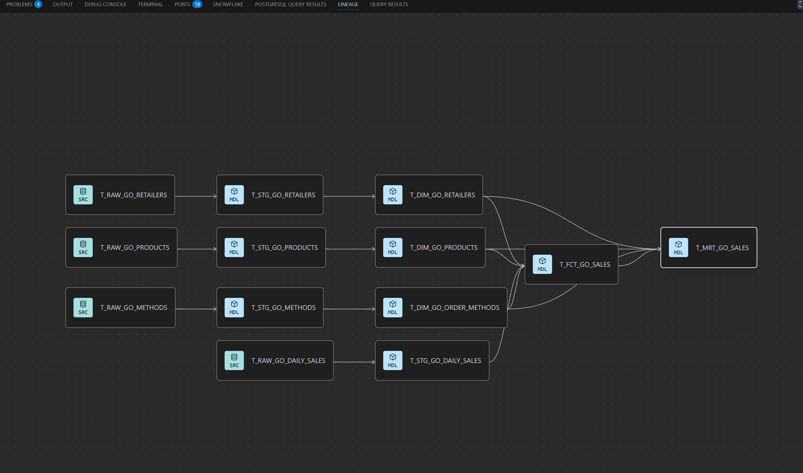

# Go Sales ❄️ Snowflake dbt Sample Project 
This repository contains a sample dbt project that demonstrates how to model and transform the GO Sales IBM sample data using dbt (data build tool) with ❄️ Snowflake as the database engine. 


### Document Control
|Version|Date|Author|Description of Change|
|-|-|-|-|
|1.0|2025-07-18|Manzar Ahmed|Initial Version|

>NOTE: This sample project utlises the [GO Sales IBM sample data](https://dataplatform.cloud.ibm.com/exchange/public/entry/view/dcf7b09bd340e6ff9a2d1869631f3753) to demonstrate dbt modeling techniques with Snowflake. The dbt models have been built so that they can be easilty adapted for other engines like Databricks, BigQuery, or Redshift with minor modifications to the dbt profiles and SQL syntax. The GO Sales dataset is a fictional retail dataset that simulates sales operations for a global retailer, and available under the MIT License. 

## Table of Content
<div class="alert alert-block alert-info" style="margin-top: 20px">

1. [Background](#1)<br>
2. [High Level Design](#2)<br>
3. [Load from S3 to Snowflake](#3)<br>
4. [Run dbt Models](#4)<br>
4.1. [Local Development Using dbt Core](#41)<br>
4.2. [Model Execution by Layer](#42)<br>
&nbsp;&nbsp;&nbsp;&nbsp;4.2.1. [Raw Models](#421)<br>
&nbsp;&nbsp;&nbsp;&nbsp;4.2.2. [Staging Models](#422)<br>
&nbsp;&nbsp;&nbsp;&nbsp;4.2.3. [Detail Models](#423)<br>
&nbsp;&nbsp;&nbsp;&nbsp;4.2.4. [Mart Models](#424)<br>
5. [Using Github and Visualise Lineage with dbt Docs](#5)<br>
5.1. [Push to GitHub](#51)<br>
5.2. [Sync with dbt Cloud](#52)<br>
5.3. [Lineage Views Across Platforms](#53)<br>
</div>
<hr>

## 1. Background <a id="1"></a>

The GO Sales IBM sample data is a fictional retail dataset designed to demonstrate business analytics, reporting, and data warehousing techniques. It simulates sales operations for a global retailer and contains various interconnected tables that model business domains. This project leverages dbt to transform the data and uses ❄️ Snowflake as the target data warehouse to house the final data solution. 

A copy of the GO Sales entity relationship diagram is provided below for reference.


This dbt_sample_snowflake project leverages dbt (data build tool) to transform the data and uses ❄️ Snowflake as the target cloud data warehouse for the final data solution. It re-uses the dbt models originally developed for DuckDB, adapting them through environment-specific configuration to point to a Snowflake endpoint. The original DuckDB-based project can be found here: https://github.com/manz01/dbt-core-sample-duckdb.

Rather than accessing the original MySQL database, this implementation sources raw CSV files from an S3 bucket, aligning with cloud-native, serverless architecture best practices and adopts the integration with Snowflake’s external stage capabilities.

**Case Sensitivity Note**

Snowflake is case-sensitive for unquoted identifiers, and by default, it stores unquoted column and table names in uppercase. To ensure cross-platform compatibility and avoid quoting issues, all column names and table identifiers in this project are standardised to uppercase.

## 2. High Level Design <a id="2"></a>

The dbt-core project follows a **layered design architecture** that structures data transformations through a series of refined stages. This layered approach promotes modularity, reusability, and is common best practice approach for building scalable data pipelines.


### Layer Breakdown:

1. **Raw Layer (`RAW`)**  
   - This layer ingests raw data directly from a AWS S3 Bucket.
   - It performs minimal transformation (if any), mainly focused on standardizing data types and storing source extracts as-is.

2. **Staging Layer (`STG`)**  
   - This layer acts as a clean-up zone where raw data is normalized, renamed, and prepared for further transformation.
   - Typical operations include renaming columns to snake_case, handling nulls, and deduplicating rows.

3. **Detailed Layer (`DET`)**  
   - This is the business logic layer, where transformations are applied to derive meaningful metrics and dimensions.
   - It includes joins, surrogate key generation, Slowly Changing Dimensions (SCD), and other enrichment logic.
   - The detailed layer will build a star schema for the go sales data

```text
 +------------------------+  +------------------+
 |T_DIM_GO_ORDER_METHOD   |  |T_DIM_GO_PRODUCT  |
 +------------------------+  +------------------+
         \              /
          \            /
           +-----------+
           |T_FCT_SALES|
           +-----------+
           /          \
          /            \
   +-------------+    +-------------------+
   |T_DIM_DATE   |    |T_DIM_GO_RETAILER  |
   +-------------+    +-------------------+
```
4. **Mart Layer (`MRT`)**  
The mart layer builds business-ready, denormalised tables designed for reporting, dashboarding, and analytical consumption.

These models typically:

- Combine multiple dimension and fact tables into a single wide table
- Pre-join and flatten hierarchical relationships
- Include calculated metrics and business-friendly labels
- Are optimised for ease of use by analysts and BI tools (e.g., Tableau, Power BI)

## 3. Load from S3 to Snowflake <a id="3"></a>

This section outlines how to securely load raw data files from an AWS S3 bucket into Snowflake using STAGE and STORAGE INTEGRATION objects.

### Step 1: Grant S3 Bucket Permissions and Create AWS IAM Role

To allow Snowflake to access your S3 bucket, follow these steps:

**1. Create an IAM Role in AWS named snowflake-access-role.**

**2. Attach a trust relationship policy that allows Snowflake to assume the role. Replace <account_locator> and <region> with your Snowflake account details:**

A trust policy (also called an assume role policy) defines which entities (principals) are allowed to assume an IAM role. In the context of Snowflake, this is essential for enabling Snowflake to access AWS resources (e.g., S3 buckets) via an IAM Role.

Purpose of the Trust Policy
It does not grant permissions to access AWS resources directly.

Instead, it controls who is allowed to assume the role.

For a Snowflake storage integration, Snowflake assumes the IAM role via a temporary security credential using this trust relationship.

Where to Find or Edit the Trust Policy
Log in to the AWS Console

Go to: `https://console.aws.amazon.com/iam`

Navigate to IAM > Roles

Click on the specific IAM Role (e.g., snowflake-access-role)

Go to the “Trust relationships” tab

Click "Edit trust policy" to review or update the trust configuration.


```json
{
	"Version": "2012-10-17",
	"Statement": [
		{
			"Effect": "Allow",
			"Principal": {
				"AWS": "arn:aws:iam::724772052480:root"
			},
			"Action": "sts:AssumeRole",
			"Condition": {
				"StringEquals": {
					"sts:ExternalId": "YO19174_SFCRole=4_fMO0LOpe1w+L+dSzEeUZW6dWcuM="
				}
			}
		}
	]
}
```

Example provided below showing the aws trust policy.



**3. Attach an S3 bucket policy allowing that role to access the bucket:**

To view or edit the permissions policy for an IAM Role (e.g., the role used in a Snowflake storage integration), follow these steps:

- Sign in to AWS Console
- Visit: https://console.aws.amazon.com/iam
- Navigate to IAM
- In the AWS Management Console, type IAM in the search bar and click on IAM under "Security, Identity, & Compliance".
- Open the Roles section
- In the IAM sidebar menu, click on Roles.
- Select your IAM Role
- Search for the role name you used in your Snowflake storage integration (e.g., snowflake-access-role).
- Click on the role name to open its details page.
- View the Permissions policies
- Under the Permissions tab, you’ll find:
      Inline policies (specific to this role)
      Managed policies (shared or AWS-provided)
- Inspect or Edit Policy
- Click on a policy name to view the JSON definition.
- If you want to attach a new policy, click “Add permissions” > “Attach policies” or create a custom one.

```json
{
  "Version": "2012-10-17",
  "Statement": [
    {
      "Sid": "AllowSnowflakeAccess",
      "Effect": "Allow",
      "Principal": {
        "AWS": "arn:aws:iam::123456789012:role/snowflake-access-role"
      },
      "Action": ["s3:GetObject", "s3:ListBucket"],
      "Resource": [
        "arn:aws:s3:::go-sales",
        "arn:aws:s3:::go-sales/*"
      ]
    }
  ]
}

```

The permissions policy is under IAM Roles, shown below.



### Step 2: Create Snowflake Storage Integration

In Snowflake, create a STORAGE INTEGRATION object to connect to your S3 bucket:

```sql
CREATE OR REPLACE STORAGE INTEGRATION gosales_s3
  TYPE = EXTERNAL_STAGE
  STORAGE_PROVIDER = S3
  ENABLED = TRUE
  STORAGE_AWS_ROLE_ARN = 'arn:aws:iam::123456789012:role/snowflake-access-role'
  STORAGE_ALLOWED_LOCATIONS = ('s3://go-sales/');
```

### Step 3: Inspect Storage Integration Metadata

To verify the storage integration and retrieve the values needed for the trust policy:

```sql
DESC INTEGRATION gosales_s3;
```

This returns details like:

| property                     | property\_value                                             |
| ---------------------------- | ----------------------------------------------------------- |
| ENABLED                      | true                                                        |
| STORAGE\_PROVIDER            | S3                                                          |
| STORAGE\_ALLOWED\_LOCATIONS  | s3://go-sales/                                              |
| STORAGE\_AWS\_IAM\_USER\_ARN | arn\:aws\:iam::724772052480\:user/externalstages/cilen90000 |
| STORAGE\_AWS\_ROLE\_ARN      | arn\:aws\:iam::123456789012\:role/snowflake-access-role     |
| STORAGE\_AWS\_EXTERNAL\_ID   | YO19174\_SFCRole=4\_fMO0LOpe1w+L+dSzEeUZW6dWcuM=            |

Use these values to update the AWS trust policy correctly.

### Step 4: Create the Snowflake Stage

Now link the S3 bucket to a named external stage:

```sql
USE DATABASE gos01;

CREATE OR REPLACE STAGE go_sales_stage
  URL = 's3://go-sales/'
  STORAGE_INTEGRATION = gosales_s3;
```

### Step 5: List the Files in the Stage

This verifies that Snowflake can see the files in your S3 bucket:

```sql
LIST @go_sales_stage;

```
Example output:

| name                               | size    | md5                              | last\_modified               |
| ---------------------------------- | ------- | -------------------------------- | ---------------------------- |
| s3://go-sales/go\_1k.csv           | 25923   | 8a5042551bbd4cb4d5058511e059e5dc | Wed, 9 Jul 2025 19:17:06 GMT |
| s3://go-sales/go\_daily\_sales.csv | 6058951 | 960eebdea858c6e4f88ce90713f97cd7 | Wed, 9 Jul 2025 19:17:10 GMT |
| s3://go-sales/go\_methods.csv      | 143     | e1b0bbcb27e61d22c86db45e2aea75dd | Wed, 9 Jul 2025 19:17:10 GMT |
| s3://go-sales/go\_products.csv     | 20402   | 476c09b0e383bebe7cf861baedffe662 | Wed, 9 Jul 2025 19:17:10 GMT |
| s3://go-sales/go\_retailers.csv    | 26334   | 2270f9fa1c82d1a0c44e2cfa15577f58 | Wed, 9 Jul 2025 19:17:11 GMT |


### Step 6: Load Raw Tables via dbt

The following dbt operations wrap Snowflake COPY jobs that hydrate the RAW layer from S3:

```sh
dbt run-operation load_raw_go_1k
dbt run-operation load_raw_go_methods
dbt run-operation load_raw_go_products
dbt run-operation load_raw_go_retailers
dbt run-operation load_raw_go_daily_sales
```

Each command maps to a macro defined in `macros/load_csv_to_snowflake.sql`. The helper macro `load_csv_to_snowflake_and_create_table` creates (or replaces) the RAW table and issues the `COPY INTO` from the external stage. The table below summarises what is loaded:

| Command | RAW table created | S3 object consumed |
| --- | --- | --- |
| `dbt run-operation load_raw_go_1k` | `T_RAW_GO_1K` | `go_1k.csv` |
| `dbt run-operation load_raw_go_methods` | `T_RAW_GO_METHODS` | `go_methods.csv` |
| `dbt run-operation load_raw_go_products` | `T_RAW_GO_PRODUCTS` | `go_products.csv` |
| `dbt run-operation load_raw_go_retailers` | `T_RAW_GO_RETAILERS` | `go_retailers.csv` |
| `dbt run-operation load_raw_go_daily_sales` | `T_RAW_GO_DAILY_SALES` | `go_daily_sales.csv` |

Excerpt from `macros/load_csv_to_snowflake.sql`:

```sql

    
    
    
    

    {{ load_csv_to_snowflake_and_create_table(table_name, file_name, columns, stage) }}

```

The shared macro performs the DDL + COPY steps so all five loads remain consistent.

```sql
CREATE OR REPLACE TABLE GOS01.RAW.T_RAW_GO_PRODUCTS (
    PRODUCT_NUMBER BIGINT,
    PRODUCT_LINE VARCHAR,
    PRODUCT_TYPE VARCHAR,
    PRODUCT VARCHAR,
    PRODUCT_BRAND VARCHAR,
    PRODUCT_COLOR VARCHAR,
    UNIT_COST DOUBLE,
    UNIT_PRICE DOUBLE
);

COPY INTO GOS01.RAW.T_RAW_GO_PRODUCTS
FROM @GOS01.RAW.GO_SALES_STAGE/go_products.csv
FILE_FORMAT = (
    TYPE = 'CSV',
    FIELD_OPTIONALLY_ENCLOSED_BY = '\"',
    SKIP_HEADER = 1,
    DATE_FORMAT = 'DD/MM/YYYY',
    ERROR_ON_COLUMN_COUNT_MISMATCH = TRUE
)
ON_ERROR = 'CONTINUE';
```
Explanation:

| Line                                        | Purpose                                                                           |
| ------------------------------------------- | --------------------------------------------------------------------------------- |
| `CREATE OR REPLACE TABLE`                   | Creates the table structure for raw product data.                                 |
| `COPY INTO`                                 | Loads the data from the staged CSV in S3 into the Snowflake table.                |
| `@GOS01.RAW.GO_SALES_STAGE/go_products.csv` | Refers to the staged file in the external stage created earlier.                  |
| `FILE_FORMAT`                               | Specifies CSV parsing options including delimiters, header rows, and date format. |
| `ON_ERROR = 'CONTINUE'`                     | Allows the load to continue even if some rows fail (useful during raw ingestion). |


## 4. Run dbt Models <a id="4"></a>

This section outlines how to build and execute dbt models using dbt Core locally, how the models are committed to GitHub, and how they are synchronised with dbt Cloud for scheduled or ad-hoc runs via the web interface.

### 4.1 Local Development Using dbt Core <a id="41"></a>

During development, dbt models are created and tested locally using VSCode and dbt Core. This allows developers to:

- Rapidly test and debug SQL models
- Use Git for version control
- Allow developers to utilise VSCode that have preference for devloping with VSCode IDE

### Set Environment Variables

First, set the required environment variables to specify the paths for the dbt project and profile directory.

```sh
export DBT_PROJ_DIR='/home/u0001/dbt_sample_snowflake'
export DBT_PROFILE_DIR='/home/u0001/dbt_sample_snowflake'
```

### Create dbt Run Alias (Shorthand)

Define a shell alias to simplify running the dbt project with the correct profile and target. This avoids repeating long command strings every time you want to run a model.

```sh
alias dbt_run_go_sales='dbt run --project-dir $DBT_PROJ_DIR --profiles-dir $DBT_PROFILE_DIR --target go_sales'
```

### 4.2. Model Execution by Layer <a id="42"></a>
Use tags to run models grouped by their logical layer:

#### 4.2.1. Raw Models <a id="421"></a>

Load the source data from S3 using the run-operations that wrap the macros in `macros/load_csv_to_snowflake.sql`:

```sh
dbt run-operation load_raw_go_1k
dbt run-operation load_raw_go_methods
dbt run-operation load_raw_go_products
dbt run-operation load_raw_go_retailers
dbt run-operation load_raw_go_daily_sales
```

Each command creates/replaces the corresponding `T_RAW_GO_*` table and issues a `COPY INTO` from `GOS01.RAW.GO_SALES_STAGE`. See Step&nbsp;6 for the full mapping of CSV files to commands.

#### 4.2.2. Staging Models <a id="442"></a>

The staging models apply snowflake naming convention, data quality checks and deduplication logic:

```sh
dbt_run_go_sales --select tag:GO_SALES_STG
```

#### 4.2.3. Detailed Models (DET) <a id="423"></a>

The detail layer handles the transformation logic for Slowly Changing Dimensions (SCDs) and builds the fact table through a surrogate lookup:

```sh
dbt_run_go_sales --select tag:GO_SALES_DET
```

#### 4.2.4. Mart Models (MRT) <a id="424"></a>

The mart layer builds business-ready transactional table by combining the fact table with the dimension tables.

```sh
dbt_run_go_sales --select tag:GO_SALES_MRT
```

## 5. Using Github and Visualise Lineage with dbt Docs <a id="5"></a>

### 5.1. Push to GitHub <a id="51"></a>
Once tested locally:

- Commit and push changes to the GitHub repository.
- GitHub serves as the central source of truth for:
  - dbt models
  - Configuration files
  - Documentation and macros

This enables version control, peer reviews, and change history tracking.

### 5.2. Sync with dbt Cloud <a id="52"></a>
After pushing to GitHub:
- You must click “Pull” in the dbt Cloud IDE or deployment environment to retrieve the latest changes.

Once pulled, you can:
 - Trigger runs from the dbt Cloud UI
 - Schedule jobs using dbt Cloud Scheduler
 - Monitor build logs, test results, and job history

Generate and explore dbt Docs, including full lineage graphs


### 5.3. Lineage Views Across Platforms <a id="53"></a>

dbt provides powerful lineage tracking capabilities that allow you to visually trace the flow of data through the different layers of the data model.

Although the lineage metadata originates from the dbt project structure and compiled DAG, it can be viewed using several interfaces depending on your environment.

#### Screenshot 1: dbt Cloud Lineage (dbt Studio)

- In this view, you can explore lineage through the dbt Cloud UI under the "Docs" tab or directly in dbt Studio.
- Highlights upstream dependencies and downstream impacts.
- Clicking a model reveals its SQL, metadata, and related nodes.



### Screenshot 2: Snowflake Lineage (UI after dbt runs)

This is a fairly new feature in snowflake. When models are built in Snowflake using dbt run, the underlying dependencies are registered in Snowflake’s metadata catalog.

- Available via the “Lineage” tab under table objects in the Snowsight interface.
- Reflects lineage based on actual execution, not just defined models.
- Useful for validating dbt's impact on Snowflake-native views and tables.



### Screenshot 3: VSCode dbt Power User Extension

The VSCode extension for dbt provides an interactive lineage graph directly in your development environment.

- Allows you to click through models and explore the DAG locally.
- Provides contextual awareness during development.
- Syncs with dbt's internal manifest for accurate rendering.


