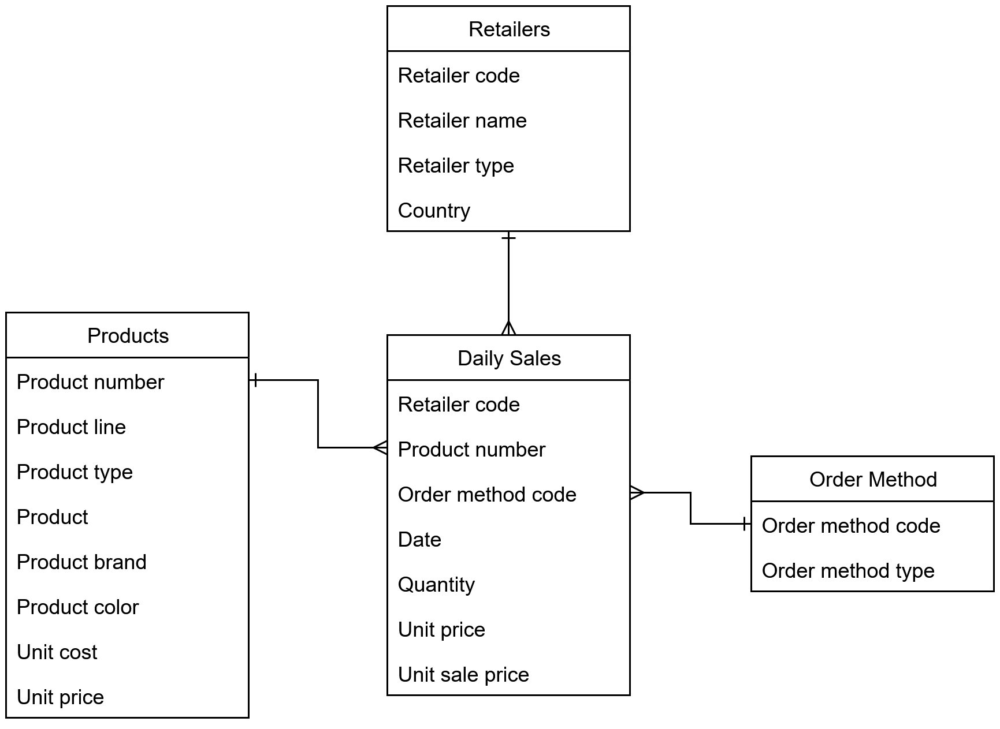

<br>

# Go Sales Snowflake dbt Sample Project 
This repository contains a sample dbt project that demonstrates how to model and transform the GO Sales IBM sample data using dbt (data build tool) with ❄️ Snowflake as the database engine. 


### Document Control
|Version|Date|Author|Description of Change|
|-|-|-|-|
|1.0|2025-07-18|Manzar Ahmed|Initial Version|

>NOTE: This sample project utlises the [GO Sales IBM sample data](https://dataplatform.cloud.ibm.com/exchange/public/entry/view/dcf7b09bd340e6ff9a2d1869631f3753) to demonstrate dbt modeling techniques. It is designed to be run with DuckDB as the database engine, but can be adapted for other engines like Snowflake, BigQuery, or Redshift with minor modifications to the dbt profiles and SQL syntax. The GO Sales dataset is a fictional retail dataset that simulates sales operations for a global retailer, and available under the MIT License. 

## 1. Background

The GO Sales IBM sample data is a fictional retail dataset designed to demonstrate business analytics, reporting, and data warehousing techniques. It simulates sales operations for a global retailer and contains various interconnected tables that model business domains. This project leverages dbt to transform the data and uses ❄️ Snowflake as the target data warehouse to house the final data solution. 

A copy of the GO Sales entity relationship diagram is provided below for reference.



# Load from S3 to Snowflake
```sh
dbt run-operation load_raw_go_1k
dbt run-operation load_raw_go_methods
dbt run-operation load_raw_go_products
dbt run-operation load_raw_go_retailers
dbt run-operation load_raw_go_daily_sales

```